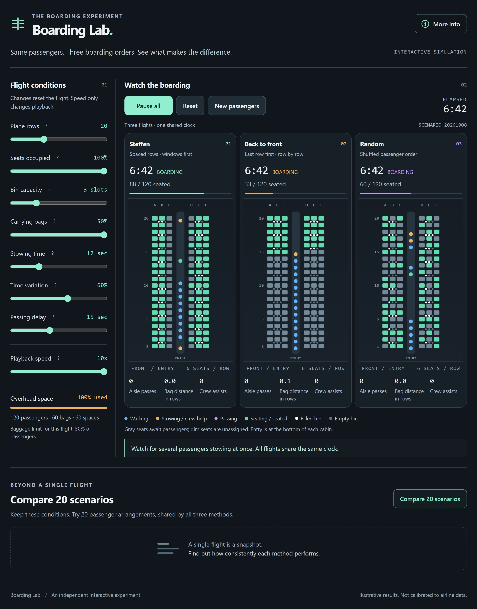

# Boarding Lab

**Same passengers. Three boarding orders. See what makes the difference.**

Boarding Lab is an interactive airplane-boarding simulator that runs **Steffen**, **back-to-front**, and **random boarding** side by side. Watch passengers walk, put away luggage, pass each other, and take their seats. Change the flight conditions, then compare 20 passenger arrangements to see whether a result holds up beyond a single flight.

### [Try the live simulator](https://jimerb.github.io/Boarding-Lab/)

Runs in your browser. No installation, account, or sign-in is required to use the simulator.



*A screenshot of boarding underway, supplied by the project owner. All three aircraft share the same passengers, seats, luggage, and individual stowing times. The visible differences come from the boarding order. This is a still image of the running simulation; open the live demo to see it move.*

## What you can explore

- Three synchronized cabins, with live boarding times, seated counts, and progress bars.
- Adjustable plane size, occupancy, luggage demand, bin capacity, stowing times, passing delay, and playback speed.
- A 20-scenario comparison showing average boarding time, outright wins, aisle passes, bag distance, and crew assists.
- A **More info** guide explaining the methods, mechanics, color legend, and limitations.
- Help that appears only when you hover over, focus, or tap a **?** button. Labels and sliders do not open tooltips.
- A responsive dark interface: side-by-side cabins on larger screens and stacked cabins on smaller screens.

## Start a flight

1. Open the [live simulator](https://jimerb.github.io/Boarding-Lab/).
2. Choose your flight conditions, or begin with the defaults: 20 rows, 100% occupancy, 3 bin slots per side per two rows, and 50% of passengers carrying an overhead bag.
3. Select **Start all**. All three methods run on one simulated clock.
4. Use **Pause all** and **Resume all** to inspect what is happening. Changing **Playback speed** speeds up the animation without changing the simulated outcome.
5. Select **Compare 20 scenarios** to compare multiple passenger arrangements under the current conditions.

**Reset** starts the same arrangement over and clears the scenario comparison. **New passengers** generates another arrangement with the same conditions. Changing a flight condition resets the flight; changing playback speed does not. Press **Escape** to dismiss tooltip help or close the information window.

## The three boarding methods

### Steffen: distribute the work along the aisle

Jason Steffen's method is designed to let several people stow luggage at once instead of clustering them in the same part of the cabin. Window-seat passengers board before middle-seat passengers, followed by aisle-seat passengers. Alternating rows create space between travelers who are about to use the bins.

This implementation boards seat columns in the order **F, A, E, B, D, C**. Within each column, even rows board from back to front, followed by odd rows from back to front. For a 20-row plane, the beginning of the queue is:

```text
20F, 18F, 16F, …, 2F,
19F, 17F, 15F, …, 1F,
20A, 18A, 16A, …
```

Unassigned seats are skipped. Columns A and F are window seats, B and E are middle seats, and C and D are aisle seats.

### Back to front: finish one row, then move forward

The last row enters first, followed by the next row toward the front. Within each row, passengers board in the fixed order **A, B, C, D, E, F**. This can concentrate luggage stowing in one part of the aisle. It represents strict row-by-row boarding, rather than every possible airline boarding-group policy.

### Random: shuffle the queue

The same assigned passengers board in a shuffled order. Random arrival can spread activity throughout the aisle, but someone may already occupy an aisle or middle seat when their window-seat neighbor arrives. Seats remain assigned: passengers do not choose any seat they like.

## Flight conditions

| Control | Range | What it changes |
| --- | --- | --- |
| Plane rows | 10–40, in steps of 2 | Six seats per row, arranged three on each side of a single aisle. |
| Seats occupied | 5–100%, in steps of 5% | The number of assigned seats, rounded to whole passengers. |
| Bin capacity | 2–6 slots | Bag slots on **each side of every pair of rows**. A 20-row plane with 3 slots has 60 spaces total. |
| Carrying bags | 0% to the capacity-based maximum | The share of passengers with one overhead bag. The upper limit adjusts so all bags fit somewhere. |
| Stowing time | 5–30 seconds | The central stowing duration before individual variation. |
| Time variation | 0–100%, in steps of 5% | How much individual stowing durations vary around that central duration. |
| Passing delay | 5–30 seconds | Time required for two passengers walking in opposite directions to pass. |
| Playback speed | 1–10× | Animation speed only; it does not change the model's timing rules or comparison results. |

At 60% variation, individual stowing durations range from approximately 40% to 160% of the selected time, rounded to seconds, with a two-second minimum. Those individual durations are shared across all three methods.

## Reading the cabins and results

The aircraft's **front entrance is at the bottom** of each diagram; larger row numbers are toward the top.

| Display | Meaning |
| --- | --- |
| Blue passenger dot | Walking or waiting in the aisle. |
| Amber passenger dot | Stowing a bag or waiting for crew assistance. |
| Purple passenger dot | Passing another passenger. |
| Green dot / seat | Taking a seat / seated. |
| Gray seat rectangle | Assigned seat awaiting its passenger. |
| Dim seat rectangle | Unassigned seat. |
| White bin dot | Occupied bin slot, claimed at the start of stowing. |
| Gray bin dot | Empty bin slot. |

**Boarding time** is measured from cabin entry until everyone in that aircraft is seated. A completed aircraft keeps its finish time while the other aircraft continue.

**Aisle passes** count actual crossings by two people traveling in opposite directions. Waiting behind someone who is putting a bag away does **not** count as a pass.

**Bag distance** is the average distance, in rows, between a passenger's assigned seat and stored bag. During a flight it covers bags already claimed; at completion it includes all overhead bags, including crew-assisted placements. A bag directly across the aisle can still be zero rows away because the metric measures row distance only.

**Crew assists** count passengers who cannot find suitable local storage and need the model's assisted-stowing process.

### Fewer passes does not necessarily mean faster boarding

Steffen's main advantage is allowing luggage stowing to happen in several places at once. It does not add overhead storage or guarantee the smallest pass count. Near-full bins can require assistance under any order. Compare total time, storage convenience, and assistance together instead of judging a method by one counter.

## How the model works

Each arrangement creates one shared manifest of occupied seats, bag assignments, individual stowing times, and a random queue. Only the boarding order differs between methods.

- **Time and movement:** the engine advances in one-second steps. Walking takes three seconds per row, with approximately one row of aisle clearance.
- **Seating:** taking a seat requires four seconds, plus seven seconds for each already seated neighbor blocking the route from the aisle.
- **Finding luggage space:** travelers reassess nearby available bins while walking, without reserving them. They prefer their own two-row bin section and side. Candidates must be within four rows of their seat, no more than one row beyond the seat, and roughly two rows behind to four rows ahead of their current position.
- **Stowing:** each overhead bag uses one slot. A slot becomes occupied when claimed, then the passenger spends their individual stowing duration in the aisle.
- **Assistance:** when suitable nearby storage is unavailable at the passenger's seat, they wait for the selected stowing time plus 20 seconds. The model then assigns available storage, which may be farther away. It does not animate a crew member's actual route.
- **Crossings:** opposite-direction travelers pause for the selected passing delay, then exchange aisle positions. Stationary stowers block walking rather than being counted as passes.

The simulation retains the revised engine from the original comparison, including bounded luggage searches, passenger spacing, and crew-assisted storage instead of unlimited passenger backtracking.

## What the 20-scenario comparison tells you

Each trial uses a different repeatable passenger arrangement. Within that trial, all three methods receive the same travelers and bags. The comparison runs in a background worker so the interface remains responsive.

The table reports average boarding time, aisle passes, bag distance, and crew assists. **Wins** count outright fastest finishes. Tied fastest finishes are reported separately and do not count as wins. If an arrangement does not finish within the 20,000-second model limit, it is excluded from **all three methods' averages**, and the excluded count is shown.

The scenario number identifies a random seed. Repeating a comparison with the same settings and scenario number repeats the same 20 arrangements. Use **New passengers** for a different set.

Twenty arrangements help distinguish a consistent pattern from one particular flight. They do not establish a confidence interval or prove how an airline would perform in practice.

### Experiments to try

- Reduce luggage demand and compare how much of each method's delay remains.
- Increase stowing-time variation and watch whether one slow traveler blocks others.
- Compare a nearly full plane with a lightly occupied one.
- Increase bin capacity and inspect bag distance and crew assists alongside total time.
- Repeat the same conditions with **New passengers** to see how sensitive the result is to the arrangement.

## Assumptions and limitations

This is an exploratory educational simulation. Its times are **not calibrated against airline operating data**.

Passengers follow the prescribed boarding order perfectly. The clock excludes time spent organizing the queue at the gate. All passengers have the same walking speed and at most one equal-size overhead bag. The model does not represent families, priority boarding, mobility needs, late arrivals, multiple doors, different bag sizes, or real crew movement and competing crew workload.

Simplified spacing, passing, and assistance rules affect the results. The baggage cap ensures sufficient total storage, but local bins can still fill up. No method should be treated as universally fastest on the strength of one simulated outcome.

## Run locally

The site is plain HTML, CSS, and JavaScript. There is no package installation or build step.

```sh
git clone https://github.com/jimerb/Boarding-Lab.git
cd Boarding-Lab
python -m http.server 8000
```

Then open **http://localhost:8000**. Any ordinary static HTTP server works; Python is just one convenient option. Serve the files over HTTP rather than opening `index.html` directly, because the 20-scenario comparison uses a Web Worker.

## Project layout

| File | Purpose |
| --- | --- |
| `index.html` | Page structure and the detailed More info guide. |
| `styles.css` | Original dark palette, responsive layout, and question-mark-only tooltip presentation. |
| `app.js` | Controls, cabin drawing, playback, metrics, accessible interactions, and comparison results. |
| `engine.js` | Passenger manifests, boarding orders, movement, baggage, seating, and simulation timing. |
| `comparison-worker.js` | Runs 20 arrangements using the same engine as the animated flight. |
| `boarding-in-progress.png` | The supplied screenshot shown above. |
| `.nojekyll` | Keeps GitHub Pages serving the static site directly. |

Optional, feature-detected WebMCP tools expose the existing playback actions and result reading in supporting browsers. They are not required to use the site.

## Publishing updates

GitHub Pages serves the **root of the `main` branch**. Commit and push an update to `main`; GitHub Pages publishes that revision after its deployment completes. All asset and worker references are relative so they work under the `/Boarding-Lab/` project path.

The repository contains the portable site, documentation, and screenshot. No Sites service configuration, account credentials, or local workspace files are needed.

## Research and background

- Jason H. Steffen, [*Optimal boarding method for airline passengers*](https://arxiv.org/abs/0802.0733), 2008.
- Jason H. Steffen and Jon Hotchkiss, [*Experimental test of airplane boarding methods*](https://arxiv.org/abs/1108.5211), submitted in 2011 and published in the *Journal of Air Transport Management* in 2012.

These papers explain the motivation behind the methods. The numbers displayed by Boarding Lab come from its own exploratory engine, not from those experiments. Boarding Lab is an independent educational project.
